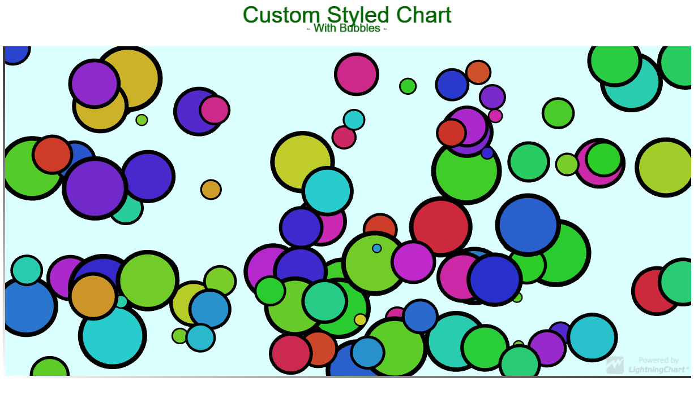

# Customized Chart - Bubbles

This demo application belongs to the set of examples for LightningChart JS, data visualization library for JavaScript.

LightningChart JS is entirely GPU accelerated and performance optimized charting library for presenting massive amounts of data. It offers an easy way of creating sophisticated and interactive charts and adding them to your website or web application.

The demo can be used as an example or a seed project. Local execution requires the following steps:

- Make sure that relevant version of [Node.js](https://nodejs.org/en/download/) is installed
- Open the project folder in a terminal:

        npm install              # fetches dependencies
        npm start                # builds an application and starts the development server

- The application is available at *http://localhost:8080* in your browser, webpack-dev-server provides hot reload functionality.

## Description

*Also known as a Bubble Series, Bubble Chart and Bubble Graph*

This example shows extensive customization of a Cartesian Chart to create a Bubble Chart using ***EllipseSeries*** as a tool.

The ***Bubble chart*** is a variation of a Scatter series where the data points have additional third dimension represented in the size of the markers ( ***bubbles*** ).

This type of series are often used to present financial or statistical data because they the easiest and well-understood visual comparisons of measures.

The series typically accepts points in format `{ x: number, y: number, size: number }`.

## API Links

* [Cartesian chart]
* [Axis]
* [Ellipse series]
* [Font settings]
* [RGBA color factory]
* [Solid FillStyle]
* [Solid LineStyle]
* [Empty FillStyle]
* [UI position origins]
* [UI Dragging modes]
* [Animator]

## Support

If you notice an error in the example code, please open an issue on [GitHub][0] repository of the entire example.

Official [API documentation][1] can be found on [Arction][2] website.

If the docs and other materials do not solve your problem as well as implementation help is needed, ask on [StackOverflow][3] (tagged lightningchart).

If you think you found a bug in the LightningChart JavaScript library, please contact support@arction.com.

Direct developer email support can be purchased through a [Support Plan][4] or by contacting sales@arction.com.

[0]: https://github.com/Arction/
[1]: https://www.arction.com/lightningchart-js-api-documentation/
[2]: https://www.arction.com
[3]: https://stackoverflow.com/questions/tagged/lightningchart
[4]: https://www.arction.com/support-services/

© Arction Ltd 2009-2020. All rights reserved.

[Cartesian chart]: https://www.arction.com/lightningchart-js-api-documentation/v2.0.0/classes/chartxy.html
[Axis]: https://www.arction.com/lightningchart-js-api-documentation/v2.0.0/classes/axis.html
[Ellipse series]: https://www.arction.com/lightningchart-js-api-documentation/v2.0.0/classes/ellipseseries.html
[Font settings]: https://www.arction.com/lightningchart-js-api-documentation/v2.0.0/classes/fontsettings.html
[RGBA color factory]: https://www.arction.com/lightningchart-js-api-documentation/v2.0.0/globals.html#colorrgba
[Solid FillStyle]: https://www.arction.com/lightningchart-js-api-documentation/v2.0.0/classes/solidfill.html
[Solid LineStyle]: https://www.arction.com/lightningchart-js-api-documentation/v2.0.0/classes/solidline.html
[Empty FillStyle]: https://www.arction.com/lightningchart-js-api-documentation/v2.0.0/globals.html#emptyfill
[UI position origins]: https://www.arction.com/lightningchart-js-api-documentation/v2.0.0/globals.html#uiorigins
[UI Dragging modes]: https://www.arction.com/lightningchart-js-api-documentation/v2.0.0/enums/uidraggingmodes.html
[Animator]: https://www.arction.com/lightningchart-js-api-documentation/v2.0.0/globals.html#animator

